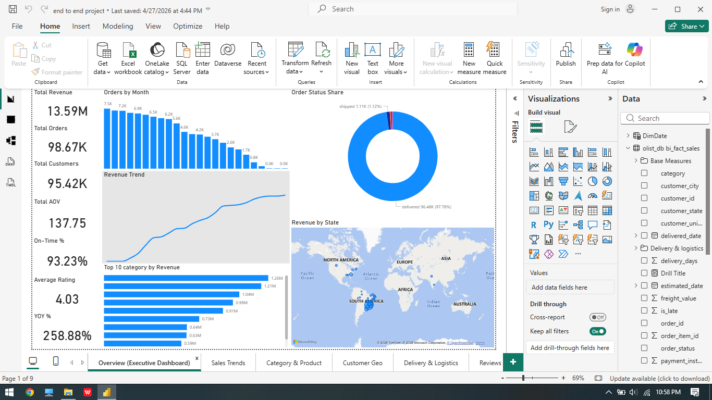
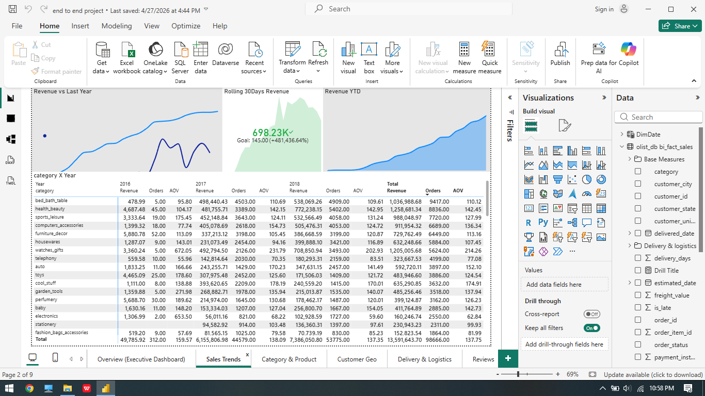
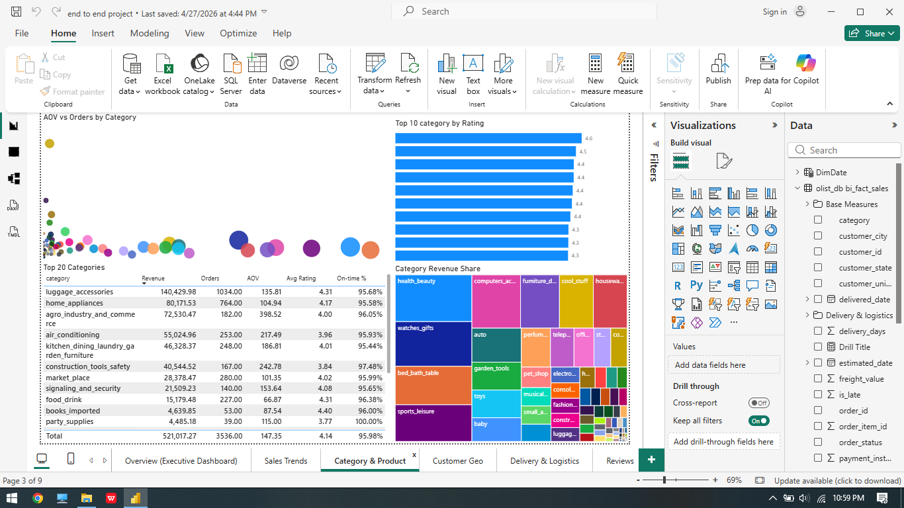
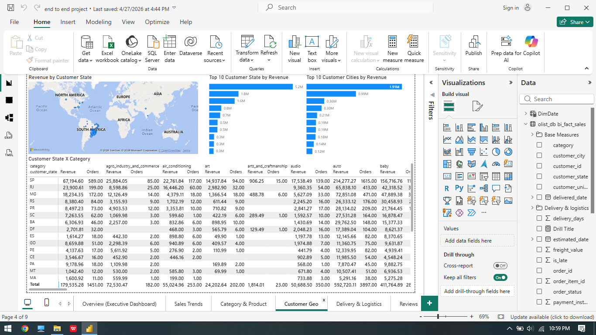
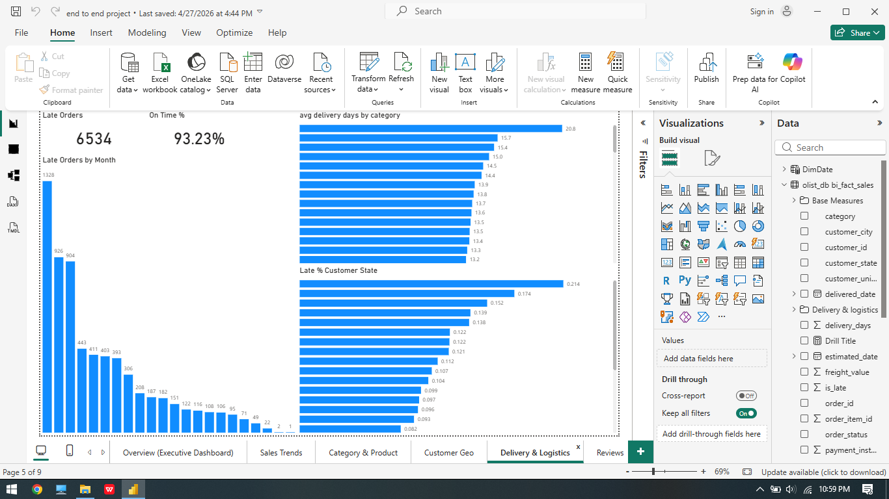
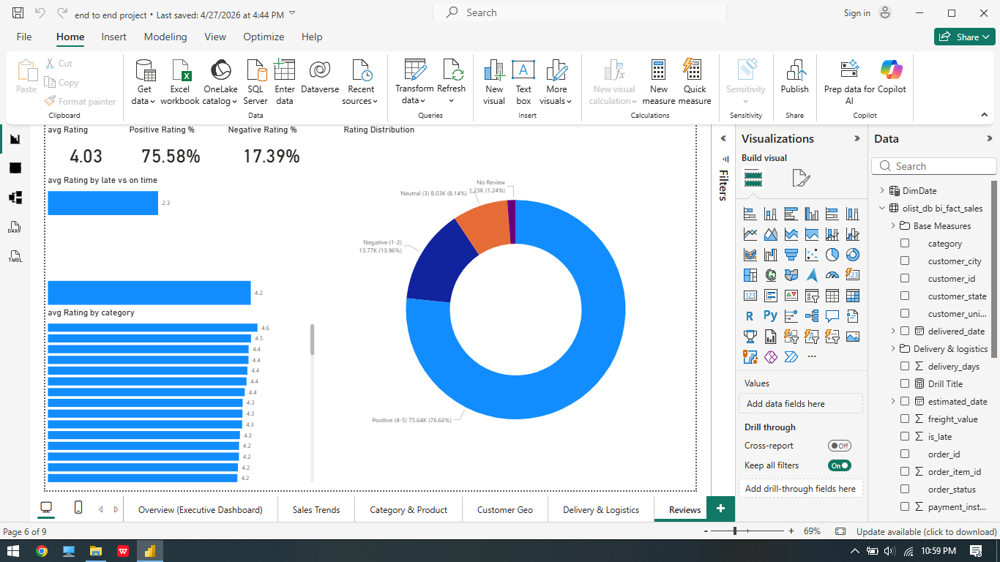
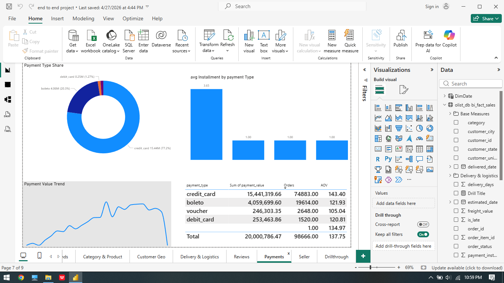
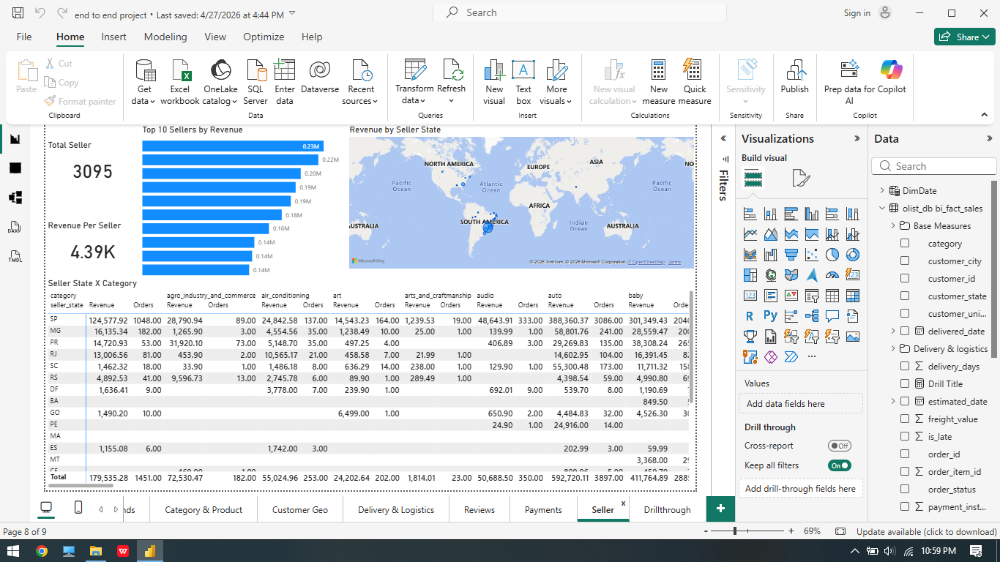

# 🛒 Olist E-Commerce Sales Analysis using MySQL & Power BI

## 📌 Project Overview

This project is an end-to-end E-Commerce Sales Analysis built using the Olist Brazilian E-Commerce Dataset. The objective of this project is to analyze sales performance, customer behavior, delivery efficiency, payment trends, seller performance, and customer satisfaction using MySQL and Power BI.

The dataset was processed and analyzed in MySQL for data preparation and exploratory data analysis (EDA), while Power BI was used to create interactive dashboards and business reports.

---

## 🎯 Objectives

- Analyze overall sales and revenue performance
- Identify top-performing product categories
- Understand customer purchasing behavior
- Evaluate delivery and logistics performance
- Analyze payment trends and seller performance
- Generate business insights using dashboards and KPIs

---

## 🛠 Tools & Technologies Used

| Tool | Purpose |
|---|---|
| MySQL | Database Management & SQL Analysis |
| Power BI | Dashboard & Visualization |
| SQL | Data Analysis |
| DAX | KPI Calculations |
| Power Query | Data Transformation |

---

## 📂 Dataset Information

**Dataset Source:** Kaggle - Olist Brazilian E-Commerce Dataset

The dataset contains information related to:
- Customers
- Orders
- Products
- Sellers
- Payments
- Reviews
- Geolocation
- Delivery & Logistics

---

## 🔄 Project Workflow

```text
Raw CSV Files
      ↓
MySQL Database
      ↓
Data Cleaning & EDA
      ↓
Power BI
      ↓
KPI Dashboard & Business Insights


🗄 Database Design & SQL Implementation

The database was designed using a relational schema approach in MySQL.

-SQL Tasks Performed
-Schema Creation
-Table Creation
-Data Loading using LOAD DATA INFILE
-Primary & Foreign Key Constraints
-Index Creation
-SQL Views Creation
-Exploratory Data Analysis (EDA)
-KPI Calculations
-Revenue Analysis
-Delivery Performance Analysis
-Customer & Seller Analysis
-Payment Analysis

🧹 Data Modeling & Preparation


-Validated relationships between tables
-Standardized data for reporting
-Optimized SQL queries using indexes
-Created reusable SQL views

📊 Dashboard Pages

1. Executive Overview Dashboard

Provides a high-level overview of:

-Total Revenue
-Total Orders
-Total Customers
-Average Order Value (AOV)
-On-Time Delivery %
-Average Customer Rating
-Revenue Trends
-Order Status Distribution

2. Sales Trends Dashboard

Analyzes:

-Revenue vs Last Year
-Rolling 30-Day Revenue
-Revenue YTD
-Category-wise yearly sales
-Orders and AOV trends

3. Category & Product Dashboard

Provides insights into:

-Top product categories
-Category revenue contribution
-AOV vs Orders analysis
-Product ratings
-Revenue share by category

4. Customer Geography Dashboard

Analyzes:

-Revenue by customer state
-Revenue by city
-Geographic customer distribution
-State-wise category performance

5. Delivery & Logistics Dashboard

Tracks:

-Late deliveries
-On-time delivery percentage
-Delivery days analysis
-State-wise delivery delays
-Logistics performance

6. Reviews Dashboard

Analyzes customer satisfaction and feedback patterns:

-Average Rating Analysis
-Positive vs Negative Rating %
-Rating Distribution
-Category-wise Ratings
-Impact of Late Delivery on Ratings

7. Payment Dashboard

Provides payment behavior insights:

-Payment Type Share
-Installment Analysis
-Payment Value Trends
-AOV by Payment Type
-Credit Card Usage Analysis

8. Seller Dashboard

Analyzes seller performance across regions:

-Total Sellers
-Revenue Per Seller
-Top Sellers by Revenue
-Seller State Performance
-Seller Category Analysis

9. Drill Through Dashboard

Interactive drill-through analysis was implemented for detailed category and customer-level exploration, enabling deeper business insights and better report navigation.


📌 Key KPIs

KPI	                    Value
Total Revenue	       13.59M
Total Orders	       98.67K
Total Customers	       95.42K
Average Order Value	 137.75
On-Time Delivery %	 93.23%
Average Rating	        4.03
YOY Growth	             258.88%

📈 Key Business Insights

-Generated 13.59M+ total revenue from nearly 100K orders
-Maintained 93%+ on-time delivery performance
-Average customer rating remained above 4.0
-Credit Card accounted for the majority of transactions
-São Paulo generated the highest customer revenue
-Health & Beauty, Bed Bath Table, and Sports Leisure were among the top-performing categories
-Late deliveries showed lower average ratings compared to on-time orders
-Positive reviews contributed more than 75% of total ratings
-Revenue showed strong year-over-year growth trends
-Seller performance varied significantly across states and categories

⚡ Technical Highlights

-Built relational database schema in MySQL
-Loaded and transformed multiple CSV datasets
-Created indexes to improve query performance
-Developed reusable SQL views for reporting
-Performed exploratory data analysis using SQL
-Created DAX measures for KPI calculations
-Implemented drill-through navigation in Power BI
-Designed interactive multi-page dashboards


📁 Project Structure

Olist-Ecommerce-Analysis/
│
├── Dataset/
│
├── SQL/
│   ├── 01_schema_creation.sql
│   ├── 02_data_loading.sql
│   ├── 03_indexes.sql
│   ├── 04_views.sql
│   ├── 05_eda_queries.sql
│
├── PowerBI/
│   └── olist_dashboard.pbix
│
├── Screenshots/
│   ├── executive_dashboard.png
│   ├── sales_dashboard.png
│   ├── category_dashboard.png
│   ├── customer_geo_dashboard.png
│   ├── delivery_dashboard.png
│   ├── reviews_dashboard.png
│   ├── payment_dashboard.png
│   ├── seller_dashboard.png
│   └── drillthrough_dashboard.png
│
└── README.md

📚 Learning Outcomes

Through this project, I improved my skills in:

-SQL Querying
-Relational Database Design
-Exploratory Data Analysis
-Power BI Dashboard Development
-DAX Calculations
-Business Intelligence Reporting
-Data Visualization
-Business Insight Generation

🚀 Future Improvements

-Add predictive analytics using Python
-Implement customer segmentation analysis
-Build real-time dashboard integration
-Improve query optimization and dashboard performance


## 📸 Dashboard Preview


















✅ Conclusion

This project demonstrates an end-to-end Business Intelligence workflow using MySQL and Power BI, covering database design, SQL analysis, KPI generation, interactive dashboard development, and business insight extraction for a real-world e-commerce business scenario.
